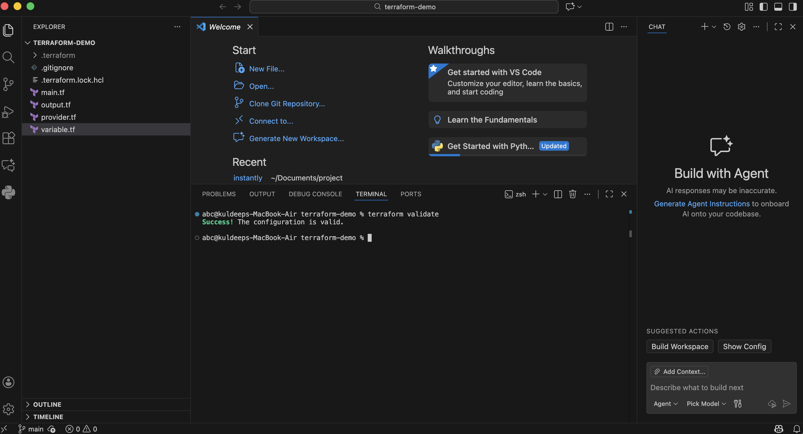
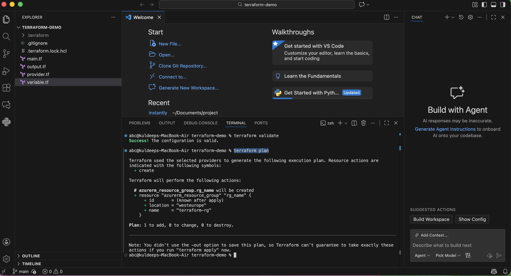

# Terraform Azure Resource Group

A beginner-friendly Terraform project that provisions an Azure Resource Group on Microsoft Azure.

This project is designed for developers and DevOps engineers who are starting their Infrastructure as Code (IaC) journey with Terraform.

---

## Prerequisites

Before using this project, ensure you have:

* An active Azure Subscription
* Terraform installed on your machine
* Azure CLI installed
* Access to create resources in Azure

### Verify Installation

```bash
terraform version
az version
```

---

## Project Structure

```text
terraform/
├── provider.tf
├── variables.tf
├── main.tf
├── output.tf
├── .gitignore
├── README.md
└── images/
    ├── terraform-validate.png
    ├── terraform-plan.png

```

---

## Files Overview

### provider.tf

Defines the Azure provider used by Terraform.

### variables.tf

Contains input variables used throughout the project.

### main.tf

Defines the Azure Resource Group resource.

### output.tf

Displays useful information after deployment.

---

## Resources Created

This project creates:

* Azure Resource Group

---

## Learning Objectives

By completing this project, you will learn:

* What Terraform is
* How Terraform Providers work
* How to use Variables
* How to define Resources
* How Outputs work
* Terraform workflow and commands
* Infrastructure as Code (IaC) fundamentals

---

## Architecture

```text
Terraform
    |
    v
Azure Resource Group
```

---

## Authenticate to Azure

Login to Azure before running Terraform commands:

```bash
az login
```

Verify the active subscription:

```bash
az account show
```

---

## Terraform Workflow

### 1. Initialize Terraform

```bash
terraform init
```

This downloads the required provider plugins.

---

### 2. Validate Configuration

```bash
terraform validate
```

Checks whether the Terraform configuration is syntactically correct.

---

### 3. Review Execution Plan

```bash
terraform plan
```

Shows what Terraform will create before making any changes.

---

### 4. Deploy Infrastructure

```bash
terraform apply
```

Type:

```text
yes
```

when prompted.

---

## Screenshots

### Terraform Validate



---

### Terraform Plan



---

### Azure Resource Group Created


---

## Clean Up Resources

To remove all resources created by Terraform:

```bash
terraform destroy
```

Type:

```text
yes
```

when prompted.

---

## Terraform Commands Reference

```bash
terraform init
terraform validate
terraform plan
terraform apply
terraform destroy
```

---

## Best Practices

* Do not commit secrets to GitHub.
* Do not commit Terraform state files.
* Use variables for configurable values.
* Review plans before applying changes.
* Keep infrastructure code under version control.

---

## Contributing

Contributions and suggestions are welcome.

If you find improvements or issues, feel free to open a Pull Request or Issue.

---

## Author

**Kuldeep Mishra**

GitHub: https://github.com/mishra-kuldeep

---

## License

This project is available for learning and educational purposes.
